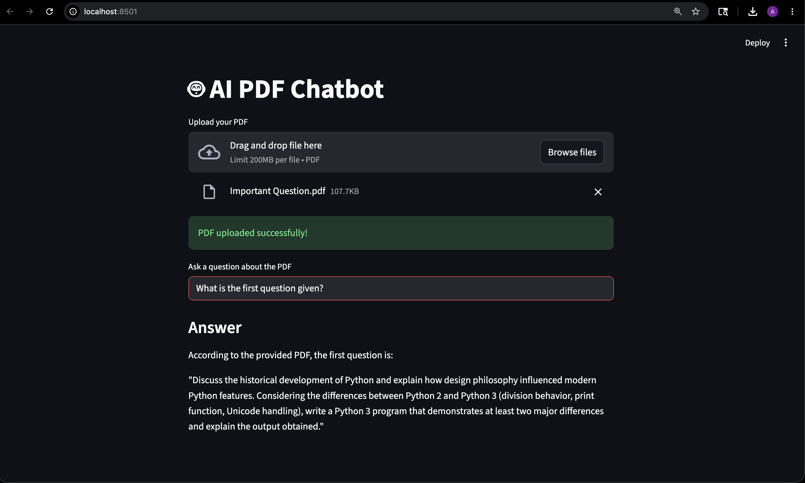

# AI PDF Chatbot


An AI-powered PDF chatbot built using Python, Streamlit, and Ollama (Llama 3).

## Features
- Upload PDF files
- Ask questions about uploaded PDFs
- Local LLM integration using Ollama
- Interactive Streamlit UI
- Works offline using local models

## Tech Stack
- Python
- Streamlit
- PyPDF2
- Ollama
- Llama 3

## Run Locally

```bash
pip install streamlit PyPDF2 ollama
streamlit run app.py
